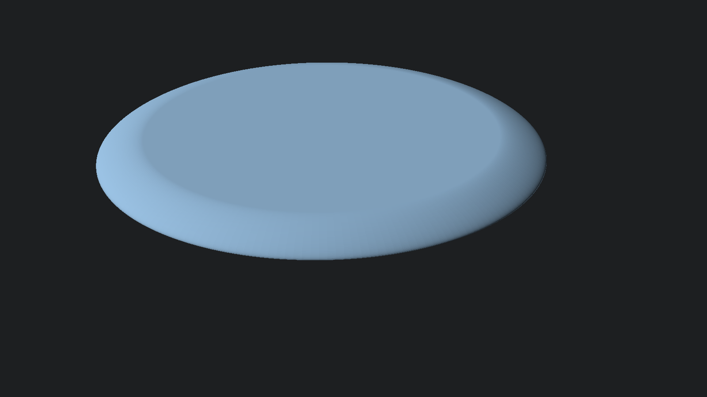
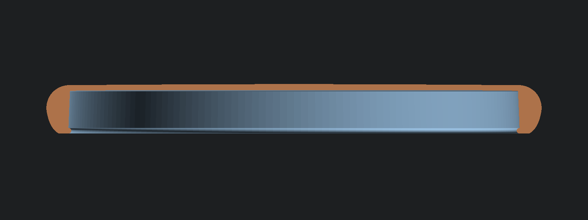

# Parametric Disc Golf Discs

A parametric OpenSCAD model of a disc golf disc, plus preset numbers for 27 famous
PDGA-approved molds and a web-based designer. Punch in the four official PDGA
measurements for any approved disc, tune a handful of shape sliders to match its
silhouette, and print your own prototypes.

## Files

| File | What it is |
|---|---|
| `disc.scad` | The parametric model. Open in OpenSCAD, tweak via **Window → Customizer**, export STL. |
| `disc.json` | Customizer preset sets for all 27 famous molds — loads automatically next to `disc.scad` (pick a preset from the Customizer dropdown). |
| `designer.html` | Interactive designer: live cross-section preview, weight estimate, PDGA legality checks, shareable URLs. **[Use it online](https://ryanmarr.github.io/parametric-disc-golf/designer.html)** or just double-click the file (no server needed). |

## Quick start

**OpenSCAD route:** open `disc.scad`, open the Customizer (Window → Customizer),
pick e.g. *Innova Destroyer* from the preset dropdown, press F6, export STL.
The console `echo` prints the estimated solid volume/weight and PDGA legality notes.

**Web route:** open `designer.html`, pick a preset, drag sliders. The estimated
weight and legality checks update live. When you like it:

- **Copy shareable URL** — the full design is encoded in the URL; bookmark it or send it to yourself to return to the exact design later.
- **Copy OpenSCAD values** — paste over the variables at the top of `disc.scad`.
- **Download Customizer preset (.json)** — import in OpenSCAD's Customizer ("+" button).

The web preview and the SCAD model share the identical Bezier profile and
Pappus-theorem weight math, so the numbers match exactly.

## Parameters

The four **PDGA measurements** come straight off any disc's certification page at
[pdga.com → Technical Standards → Approved Discs](https://www.pdga.com/technical-standards/equipment-certification/discs)
(PDGA lists them in cm; the model uses mm):

- `diameter` — outer diameter ("Diameter")
- `height` — resting plane to top center ("Height")
- `rim_depth` — rim bottom to flight-plate underside ("Rim Depth")
- `rim_width` — outer edge to inner rim wall ("Rim Thickness")

**Shape character** sliders control what PDGA numbers can't capture:

- `dome` (0–1) — flat top → very domey. Note: actual dome *height* is `height − rim_depth − plate_thickness`, which falls out of the PDGA numbers; this slider shapes the curve.
- `shoulder_roll` (0–1) — 0 keeps a flat band on top of the rim (visible crease where the dome meets it); higher values roll the dome continuously over the shoulder toward the nose, like most real molds. No effect on flat-top discs.
- `nose_height` (0.1–0.7) — where the widest point sits, as a fraction of height. Drivers ≈ 0.3, putters ≈ 0.5.
- `nose_sharpness` (0–1) — blunt putter nose → sharp driver nose. Roughly the inverse of PDGA's "Rim Configuration" rating (putters 55–70 → ~0.1; drivers 26–30 → ~0.75).
- `wing_shape` (−1 to +1) — concave driver undercut → straight → convex putter wing.
- `bottom_land` — width of the flat band the disc rests on.
- `bead` — bead size in mm (0 = beadless). A circular lobe at the rim's bottom-inside corner, always tangent to the resting plane (the bead ring is what the disc rests on; with a bead the land floats above it). Micro bead ≈ 0.4, classic (Wizard/Judge) ≈ 0.8–1, big bead ≈ 1.5.
- `bead_angle` (0–90°) — the direction the bead protrudes: **0° = straight down** from the rim bottom at the wall line (how most beaded putters look — default), 45° ≈ the diagonal lobe in Innova's patent cross-section (US5531624 fig. 17), 90° = inward from the wall.
- `plate_thickness`, `inner_wall_draft`, `wall_fillet` — flight plate and inner rim details.
- `label_text` — optional text engraved into the **underside** of the flight plate, centered (mirrored so it reads correctly when you flip the disc over; `label_size`/`label_depth` to taste).

## Famous mold presets (PDGA-verified, July 2026)

Dimensions scraped from each mold's official PDGA certification page. Flight
numbers are manufacturer-published. All lengths in mm, max weight in g.

| Disc | Flight | Ø | Height | Rim depth | Rim width | Max wt |
|---|---|---|---|---|---|---|
| **Putters & approach** |
| Innova Aviar P&A | 2/3/0/1 | 212 | 20 | 15 | 9 | 176.0 |
| Dynamic Discs Judge | 2/4/0/1 | 212 | 20 | 15 | 11 | 176.0 |
| Discmania P2 | 2/3/0/1 | 212 | 21 | 15 | 10 | 176.0 |
| Discraft Luna | 3/3/0/2 | 211 | 20 | 14 | 11 | 175.1 |
| Discraft Zone | 4/3/0/3 | 211 | 20 | 13 | 12 | 175.1 |
| Axiom Envy | 3/3/−1/2 | 210 | 18 | 14 | 11 | 174.3 |
| Gateway Wizard | 2/3/0/2 | 210 | 21 | 18 | 10 | 174.3 |
| **Midranges** |
| Discraft Buzzz | 5/4/−1/1 | 217 | 19 | 13 | 12 | 180.1 |
| Innova Roc3 | 5/4/0/3 | 218 | 20 | 13 | 14 | 180.9 |
| Innova Mako3 | 5/5/0/0 | 217 | 19 | 14 | 14 | 180.1 |
| Discmania MD3 | 5/5/0/2 | 218 | 19 | 13 | 14 | 180.9 |
| Axiom Hex | 5/5/−1/1 | 214 | 16 | 13 | 14 | 177.6 |
| DD EMAC Truth | 5/5/0/2 | 217 | 18 | 12 | 15 | 180.1 |
| **Fairway drivers** |
| Innova Teebird | 7/5/0/2 | 212 | 15 | 11 | 17 | 176.0 |
| Innova Leopard | 6/5/−2/1 | 212 | 16 | 11 | 16 | 176.0 |
| Innova Eagle | 7/4/−1/3 | 212 | 16 | 12 | 17 | 176.0 |
| Latitude 64 River | 7/7/−1/1 | 215 | 19 | 12 | 18 | 178.5 |
| Discraft Undertaker | 9/5/−1/2 | 211 | 18 | 11 | 19 | 175.1 |
| Discmania FD | 7/6/−1/1 | 212 | 18 | 11 | 18 | 176.0 |
| Innova Roadrunner | 9/5/−4/1 | 211 | 14 | 12 | 18 | 175.1 |
| Discmania Tilt | 9/1/1/6 | 211 | 16 | 12 | 20 | 175.1 |
| **Distance drivers** |
| Innova Destroyer | 12/5/−1/3 | 211 | 14 | 12 | 22 | 175.1 |
| Innova Wraith | 11/5/−1/3 | 211 | 14 | 12 | 21 | 175.1 |
| Discraft Zeus | 12/5/−1/3 | 211 | 16 | 12 | 23 | 175.1 |
| Innova Shryke | 13/6/−2/2 | 211 | 17 | 12 | 23 | 175.1 |
| Discmania DD3 | 12/5/−1/3 | 210 | 18 | 12 | 24 | 174.3 |
| Discraft Nuke | 13/5/−1/3 | 212 | 16 | 12 | 25 | 176.0 |

## PDGA legality (what the checks enforce)

From the current [PDGA Technical Standards](https://www.pdga.com/technical-standards)
(May 2026 revision):

- **Weight** ≤ 8.3 g per cm of diameter (so a 21.1 cm disc caps at 175.1 g), absolute max 200 g
- **Diameter** 21.0–30.0 cm
- **Rim depth** 5–12 % of diameter
- **Rim width** ≤ 2.6 cm; **inside rim diameter** ≥ 15.8 cm
- **Flight plate** ≤ 0.5 cm thick; underside ≥ 0.3 cm above the rim-bottom plane
- **Leading edge** must pass a 1.6 mm radius gauge (no razor noses)
- **Rim configuration** rating ≥ 26; flexibility ≤ 12.25 kg; rim bottom must sit flush; no holes in the flight plate

Homemade discs aren't tournament-legal anyway (discs must be produced by a
registered manufacturer), but staying inside these numbers keeps your prototypes
flying like the real thing.

## Printing tips

- **Material:** TPU (~95A) is the community favorite — durable and flexible like premium plastic. PETG works for stiff, overstable prototypes; PLA is easy but shatters on trees.
- **Weight:** a 100 % solid TPU driver comes out ~180 g — over the max and sluggish. Tune slicer infill (e.g. 15–30 % gyroid) and wall count to hit your target; the solid-weight estimate here is your upper bound.
- **Orientation:** print flat, top side up. No supports needed for most putter/mid profiles; drivers with strong wing undercuts may want a small support ring or a slightly less concave `wing_shape`.
- **First layer:** the bottom land is the resting surface — a clean first layer matters. A slight negative `wing_shape` reduces elephant-foot impact on flight.
- Export at `smoothness = 200+` and `curve_steps = 48+` for production STLs.

## Data sources

- PDGA approved-disc database: https://www.pdga.com/technical-standards/equipment-certification/discs (per-disc pages, e.g. [Destroyer](https://www.pdga.com/technical-standards/equipment-certification/discs/destroyer), [Buzzz](https://www.pdga.com/technical-standards/equipment-certification/discs/buzzz), [Judge](https://www.pdga.com/technical-standards/equipment-certification/discs/judge))
- PDGA Technical Standards: https://www.pdga.com/technical-standards ("Revised May 7, 2026" edition)
- Flight numbers: manufacturer catalogs (Innova, Discraft, Discmania, Dynamic Discs, Latitude 64, Axiom/MVP, Gateway)

## License

MIT — see [LICENSE](LICENSE). Disc mold names belong to their manufacturers; the
measurements are public data from the PDGA certification database. This project
is for personal prototyping and is not affiliated with the PDGA or any manufacturer.
